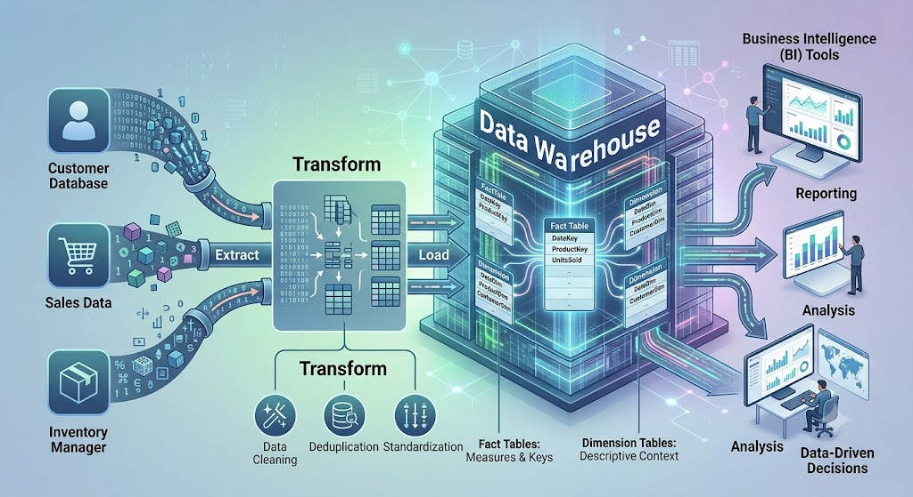

# AI-Retrieval-Augmented-Generation-RAG-Pipeline


> **CSIA6853 (Natural Language Processing) Honours Final Project**  
> **Author:** Lukhanyo Floris Kalashe


*(Note: Upload the generated image to your repo and update this path if needed)*

## Executive Summary
This repository contains the code, evaluation notebooks, and final research paper for a localized **Retrieval-Augmented Generation (RAG)** system. Built to assist Software Engineering students, the system extracts factually grounded answers from highly fragmented, bullet-point-heavy university lecture slides. 

By engineering a **Hybrid Reciprocal Rank Fusion (RRF) pipeline** protected by strict mathematical confidence gates, the system completely eliminated LLM hallucinations and achieved a **0.786 semantic accuracy score**.

---

## The Challenge
Standard LLMs hallucinate when asked highly specific, course-related academic questions. While standard RAG architectures solve this for continuous, dense documents (like Wikipedia or scientific papers), they fail when applied to undergraduate lecture slides, which are:
* **Incredibly sparse** (mean length of just 42.9 words per slide).
* **Heavily bullet-pointed** with empty structural headers.
* **Fragmented**, with single concepts spanning across multiple pages.

---

## Architecture & Pipeline

The system transforms 398 pages of messy PDFs into actionable insights via a 6-step pipeline:

1. **User Query:** Natural language question input.
2. **Dense Confidence Gate:** A strict `>0.25` cosine similarity threshold mathematically blocks out-of-scope queries (e.g., "What is the capital of France?") before hitting the LLM.
3. **Hybrid Retrieval (Top 5):** Reciprocal Rank Fusion combines Dense semantic embeddings (`all-MiniLM-L6-v2` + FAISS) with Sparse exact-keyword matching (`TF-IDF`).
4. **Context Assembly:** Raw chunks are merged with layout-preserving metadata (`[document_name]`, `[page_number]`).
5. **Generation:** `GPT-4o-mini` is invoked at `temperature=0.1`.
6. **Grounded Answer:** The LLM synthesizes the fragments and outputs a cohesive answer with explicit academic citations.

---

## Key Engineering Breakthroughs (The "Pivots")

A major focus of this project was data-driven iteration and error analysis:

* **Data-Driven Chunking:** Abandoned standard 300-token chunking after data exploration revealed a mean slide length of 43 words. Pivoted to **Page-Level Chunking** to protect semantic boundaries and prevent context fracturing.
* **The Hybrid RRF Leap:** Discovered that pure Dense retrieval suffered from academic vocabulary misses, while Sparse retrieval fed false positives to the LLM, causing "confident hallucinations." Fusing them via RRF eliminated these blind spots.
* **Multi-Metric Automated Evaluation:** Replaced basic cosine similarity with an automated, multi-metric scoring layer. Combined **SBERT** (semantic meaning) and **BERTScore F1** (token-level factual precision) to objectively prove the elimination of hallucinations and remove human-grading bias.
* **Summarization Bottleneck:** Proved experimentally that asking an LLM to "pre-summarize" retrieved chunks prior to generation causes severe information loss. Raw context performs better.

---

## Results & Impact

* **Accuracy Boost:** The Hybrid RRF architecture elevated the system's ground-truth semantic similarity score from a `0.351` baseline to **`0.786` (a massive +0.434 gain)**.
* **Retrieval Success:** Achieved a **90% Recall@5** success rate on formal ground-truth testing.
* **Reliability:** The 0.25 dense confidence gate successfully reduced the hallucination rate to **0%** on out-of-scope queries.

---

## Tech Stack
* **Language:** Python
* **AI/NLP Models:** GPT-4o-mini (OpenAI API), Sentence-Transformers (`all-MiniLM-L6-v2`)
* **Core Libraries:** LangChain, FAISS, Scikit-learn, PyMuPDF
* **Evaluation:** SBERT, BERTScore, Pandas, Matplotlib

---

## Installation & Usage

### Prerequisites
* Python 3.10+
* An active OpenAI API Key

### Setup Instructions
1. Clone the repository:
```bash
   git clone [https://github.com/lukskalashs/AI-Retrieval-Augmented-Generation-RAG-Pipeline]
   